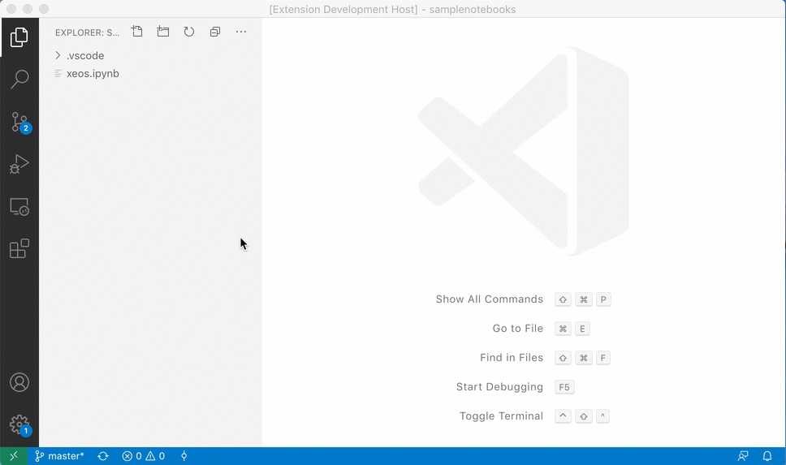

# Simple Jupyter Notebook

A sample notebook implementation that supports the xeus kernel.

The main focus of this sample is to show how to implement notebook debugging functionality based on the xeus kernel which already supports the [Debug Adapter Protocol](https://microsoft.github.io/debug-adapter-protocol/) (DAP) natively.

In detail the sample shows how to:
- find and start the xeus kernel,
- run (evaluate) notebook cells without debugging,
- implement a VS Code debugger that talks to a xeus kernel and tunnels the Debug Adapter Protocol (DAP) over the Jupyter Debug Protocol,
- intercept the DAP messages in order to map back and forth between VS Code's notebook cells and xeus's cell representation.


## Running the sample

We assume that you have already cloned this repository, ran `npm install` and opened the project in VS Code.

In order to use cell debugging you will need a kernel implementing the Jupyter Debug Protocol. For now, the only kernel implementing this protocol, is **xeus-python** a new Jupyter kernel for the Python programming language. You can either install xeus-python locally (which might interfere with your Python installation in undesired ways) or you can run the extension remotely in a preconfigured Docker container that will have everything you need.

### Running sample in Docker Container

- Make sure that Docker is running
- Make sure to have the VS Code "Remote Development" extension installed
- In VS Code click on the left green area in the status bar and from the Quickpick select the "Remote-Containers: Reopen in Container" command.
This will create and start a Docker image with all prereqs and open the extension project remotely in Docker.

### Running sample locally

- Install xeus-python for example by running something like `conda install xeus-python -c conda-forge`

Now you are done with either of these setups.

Pressing "F5" opens another VS Code window with a project folder containing a sample Jupyter notebook.

Before doing anything with this notebook, press F1 and type "kernel". Run the `Simple Jupyter Notebook: Change Kernel` command. The resulting Quickpick lists the kernels discovered on your machine and should show an **xpython** entry that represents the xeus-python kernel. Select that entry.

If there is no xpython entry that's an indication that we can't find a Jupyter kernel out of the box (e.g. with some conda setup that places things in non-default paths), you can set the correct path in the `simple-jupyter.searchPaths` config key, see the [this page](https://jupyter-client.readthedocs.io/en/stable/kernels.html#kernel-specs) to get an idea of what the paths look like.

In this notebook you can edit and run (evaluate) cells without debugging.

Or you can enable debug mode by pressing the "bug" action in the editors toolbook.
This shows the debug toolbar and makes the breakpoint gutter available where you can set breakpoints.
When you now run cells, breakpoints are hit and you can inspect variables and datastructures in VS Code's usual debugger views and panes.




## Implementation Notes

These notes cover only the debugging functionality of the notebook implementation which lives exclusively in the source file `debugging.ts`.

The first section explains how the debugger in the xeus kernel is made available to VS Code and the second section shows how this debugger is used to debug individual notebook cells.

### Making the xeus kernel's debugger available to VS Code

The xeus kernel implements the debug adapter protocol (DAP) but the DAP messages (requests, responses, and events) are wrapped as Jupyter messages for the [Jupyter Debug Protocol](https://jupyter-client.readthedocs.io/en/stable/messaging.html) (the Jupyter message types for the wrappers are 'debug_request', 'debug_reply', and 'debug_event').

To make this protocol available as a regular VS Code debug adapter we implement a `vscode.DebugAdapter` that in the incoming direction receives Jupyter messages from the xeus kernel, unwraps the DAP message and forwards them to VS Code. In the outgoing direction it wraps the DAP messages received from VS Code as Jupyter messages and sends them to the xeus kernel.

In the following `XeusDebugAdapter` implementation the `isDebugMessage` predicate checks whether a Jupyter message contains a DAP message payload.
```ts
class XeusDebugAdapter implements vscode.DebugAdapter {

  private readonly sendMessage = new vscode.EventEmitter<vscode.DebugProtocolMessage>();
  private readonly messageListener: Subscription;

  onDidSendMessage: vscode.Event<vscode.DebugProtocolMessage> = this.sendMessage.event;

  constructor(private readonly kernel: IRunningKernel) {
    this.messageListener = this.kernel.connection.messages.pipe(filter(isDebugMessage))
      .subscribe(evt => {
        this.sendMessage.fire(evt.content);
      });
  }

  async handleMessage(message: DebugProtocol.ProtocolMessage) {
    if (message.type === 'request') {
      this.kernel.connection.sendRaw(debugRequest(message as DebugProtocol.Request));
    } else if (message.type === 'response') {
      this.kernel.connection.sendRaw(debugResponse(message as DebugProtocol.Response));
    } else {
      console.assert(false, `Unknown message type to send ${message.type}`);
    }
  }

  dispose() {
    this.messageListener.unsubscribe();
  }
}
```

The debugger available in the xeus kernel is surfaced as a VS Code debugger of type `xeus` through this static contribution in the extension's `package.json`:

```
  "debuggers": [
    {
      "type": "xeus",
      "label": "xeus Debug"
    }
  ],
  "activationEvents": [
    "onDebug:xeus"
  ],
```

The debugger's implementation (class `XeusDebugAdapter` from above) is registered dynamically when the extension is activated:

```ts
  vscode.debug.registerDebugAdapterDescriptorFactory('xeus', {
    createDebugAdapterDescriptor: session => {
      const kernel =  /* get correct kernel */
      return new vscode.DebugAdapterInlineImplementation(new XeusDebugAdapter(kernel));
    }
  })
```

### Notebook cell debugging with the xeus debugger

A notebook is a structured document and the individual cells are not directly available for typical debuggers because they expect the code in files on disk. This means that debugging a cell typically requires to store the cell's contents in a temporary file.

A consequence of this is that the debugger needs breakpoints locations in terms of these temporary files and when hitting a breakpoint it will report back the source location based on the temporary file.

Since these temporary files are an implementation detail invisible to users, all cell references must be mapped to temporary files and temporary files back to cell references.

This mapping is implemented in the `XeusDebugAdapter` because that's the central place where all messages between xeus and VS Code travel through. Two maps are used for mapping cell URIs to temp file paths and temp file paths back to `vscode.NotebookCell`:

```ts
  private readonly cellToFile = new Map<string, string>();
  private readonly fileToCell = new Map<string, vscode.NotebookCell>();
```

To apply the mapping we have to find all places in the DAP protocol where file paths are used. These places are all represented by the `DebugProtocol.Source` interface and the utility function `visitSources` can be used to "visit" those places and perform the mapping (since the the `visitSources` function depends heavily on the DAP specification, it should live in the corresponding DAP mode module but now, the sample contains a copy that might be out of date).

With this the receiving side in the `XeusDebugAdapter` becomes this:
```ts
  constructor(private readonly kernel: IRunningKernel) {
    this.messageListener = this.kernel.connection.messages.pipe(filter(isDebugMessage))
      .subscribe(evt => {

        // map Sources from Xeus to VS Code
        visitSources(evt.content, source => {
          if (source && source.path) {
            const cell = this.fileToCell.get(source.path);
            if (cell) {
              source.name = path.basename(cell.uri.path);
              const index = cell.notebook.cells.indexOf(cell);
              if (index >= 0) {
                source.name += `, Cell ${index+1}`;
              }
              source.path = cell.uri.toString();
            }
          }
        });

        this.sendMessage.fire(evt.content);
      });
  }
```
We just try to map a source path to a cell and if there is one, we use the cell's URI. The display name of the source is set to the notebooks base name followed by the cell's index with the notebook.

```ts
  async handleMessage(message: DebugProtocol.ProtocolMessage) {
    if (message.type === 'request') {
      this.kernel.connection.sendRaw(debugRequest(message as DebugProtocol.Request));
    } else if (message.type === 'response') {
      this.kernel.connection.sendRaw(debugResponse(message as DebugProtocol.Response));
    } else {
      console.assert(false, `Unknown message type to send ${message.type}`);
    }
  }
```

Mapping into the other direction is very similar but with a twist:
in this case we not only have to map cell URIs to temporary file paths but we have to trigger the actual creation of the temporary files and to update the dictonaries used for the mapping.

Since xeus is a notebook kernel that supports cell debugging, xeus provides support for storing cell contents in temporary files via an extension to the Debug Adapter Protocol. The `dumpCell` request takes the contents of a cell as a string, saves it to disk, and returns a path to the file.

VS Code can easily use this custom DAP request via the extension API `DebugSession.customRequest`. Here is the resulting utility for storing a cell and updating the maps:

```ts
private async dumpCell(cell: vscode.NotebookCell): Promise<void> {
  try {
    const response = await this.session.customRequest('dumpCell', { code: cell.document.getText() });
    this.fileToCell.set(response.sourcePath, cell);
    this.cellToFile.set(cell.uri.toString(), response.sourcePath);
  } catch (err) {
    console.log(err);
  }
}
```

With this the outbound mapping in the `XeusDebugAdapter` becomes this:

```ts
  async handleMessage(message: DebugProtocol.ProtocolMessage) {

    // intercept 'setBreakpoints' request
    if (message.type === 'request' && (<any>message).command === 'setBreakpoints') {
      const args = (<any>message).arguments;
      if (args.source && args.source.path && args.source.path.indexOf('vscode-notebook-cell:') === 0) {
        await this.dumpCell(args.source.path);
      }
    }

    // map Source paths from VS Code to Xeus
    visitSources(message, source => {
      if (source && source.path) {
        const p = this.cellToFile.get(source.path);
        if (p) {
          source.path = p;
        }
      }
    });

    if (message.type === 'request') {
      this.kernel.connection.sendRaw(debugRequest(message as DebugProtocol.Request));
    } else if (message.type === 'response') {
      this.kernel.connection.sendRaw(debugResponse(message as DebugProtocol.Response));
    } else {
      console.assert(false, `Unknown message type to send ${message.type}`);
    }
  }
```
First we detect the `setBreakpoint` request where store the cell's contents in the temporary file.
And then we use `visitSources` for the mapping.
